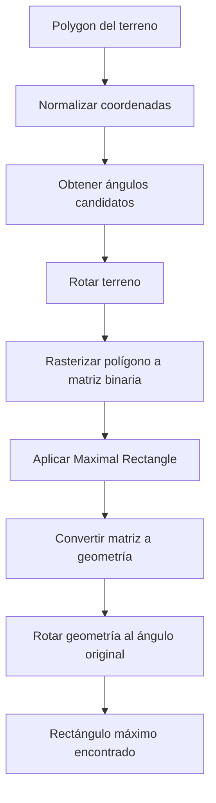
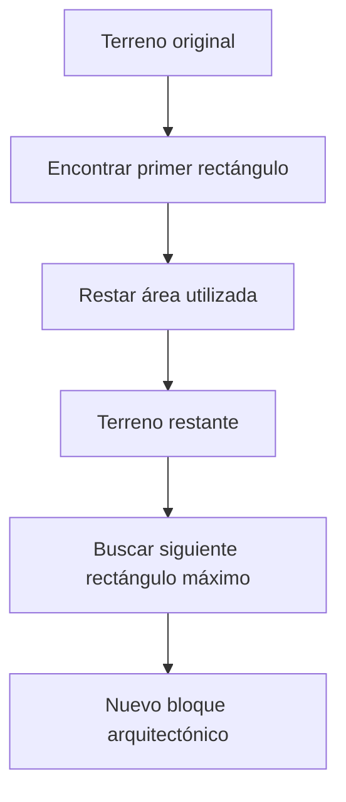
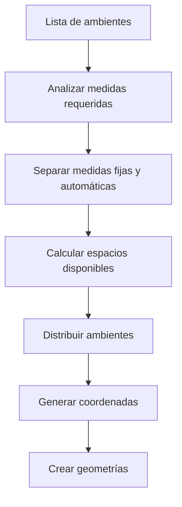
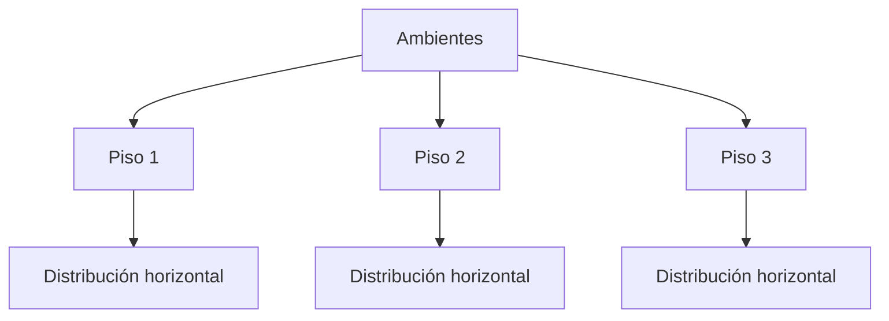
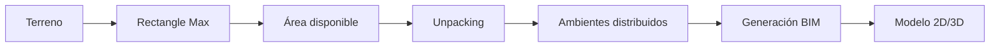

# 1. Algoritmo Rectangle Max

## Descripción General

El algoritmo Rectangle Max permite encontrar el rectángulo máximo utilizable dentro de un terreno irregular.

Su objetivo es identificar el área rectangular más grande disponible para ubicar bloques arquitectónicos dentro del terreno.

Aplicaciones:

- Ubicación de pabellones.
- Distribución inicial de bloques.
- Optimización del área construible.


---

# Problema que resuelve

Dado un terreno representado como un polígono irregular:

```text
        Terreno irregular

      ****************
    **                **
   *                    *
   *                    *
    **              ****
       **************
````

El algoritmo busca:

```text
      +-------------+
      |             |
      |  Rectángulo |
      |    máximo   |
      |             |
      +-------------+
```

Encontrando la mayor área rectangular posible dentro del terreno.

---

# Flujo del Algoritmo



---

# Etapas Internas

## 1. Normalización del Terreno

Función:

```
normalizar_polygon()
```

Responsabilidad:

Transformar coordenadas grandes (ejemplo UTM) a un sistema local cercano a:

```
(0,0)
```

Beneficios:

* Menor error numérico.
* Operaciones geométricas más estables.

---

## 2. Obtención de Ángulos Candidatos

Función:

```
get_candidate_angles()
```

Responsabilidad:

Analizar los lados del terreno para obtener posibles orientaciones del rectángulo.

Ejemplo:

```text
Lado del terreno
        |
        |
        +------------

Ángulo candidato:
0°
90°
45°
```

Esto evita probar infinitas rotaciones.

---

## 3. Conversión a Matriz Binaria

El polígono se convierte a una matriz:

```text
0 0 0 0 0

0 1 1 1 0

0 1 1 1 0

0 0 0 0 0
```

Donde:

* 1 = área disponible.
* 0 = fuera del terreno.

---

## 4. Maximal Rectangle

Función:

```
maximal_rectangle()
```

Utiliza una estrategia basada en:

* Histograma por filas.
* Stack monotónico.
* Cálculo de áreas máximas.

Salida:

```text
Área máxima

Posición:
(x,y)

Dimensiones:

ancho
largo
```

---

# Optimización de Búsqueda

El algoritmo utiliza dos fases:

## Primera pasada

Objetivo:

Encontrar una solución aproximada rápidamente.

Configuración:

```
cell_size = 0.5
```

Menor precisión.

Mayor velocidad.

---

## Segunda pasada

Objetivo:

Refinar el resultado encontrado.

Configuración:

```
cell_size = 0.2
```

Mayor precisión.

Menor error.

---

# Búsqueda de Siguientes Rectángulos

Función:

```
find_next_best_rectangle()
```

Permite obtener nuevos bloques dentro del terreno restante.

Flujo:



---

# Entrada Rectangle Max

```text
Polygon terreno
```

Ejemplo:

```json
[
 [0,0],
 [100,0],
 [100,50],
 [0,50]
]
```

---

# Salida Rectangle Max

Retorna:

* Geometría del rectángulo.
* Área calculada.
* Ángulo de rotación.

Ejemplo:

```json
{
 "area": 3200,
 "angle": 15,
 "geometry": "POLYGON(...)"
}
```

---

# 2. Algoritmo de Distribución / Unpacking de Ambientes

## Descripción

Este algoritmo distribuye ambientes dentro del área disponible generando una configuración arquitectónica válida.

Objetivos:

* Aprovechar espacio disponible.
* Mantener distribución ordenada.
* Generar dimensiones automáticamente.

---

# Flujo del Algoritmo



---

# Distribución de Medidas

El algoritmo permite definir:

## Medidas fijas

Ejemplo:

```text
Aula = 8m
Laboratorio = 10m
```

## Medidas automáticas

Ejemplo:

```text
Auto
Auto
Auto
```

El sistema calcula:

```
espacio restante / cantidad automática
```

---

# Generación de Coordenadas

Función:

```
acumate_coords()
```

Transforma medidas:

Entrada:

```text
[5,10,15]
```

Salida:

```text
[
 [0,5],
 [5,15],
 [15,30]
]
```

Representando posiciones dentro del plano.

---

# Distribución por Pisos

El algoritmo soporta agrupación por niveles:



---

# Entrada Unpacking

Información:

* Lista de ambientes.
* Dimensiones disponibles.
* Número de pisos.
* Restricciones espaciales.

---

# Salida Unpacking

Genera:

* Coordenadas.
* Dimensiones finales.
* Ubicación de ambientes.
* Información para creación geométrica.

---

# Integración con BIM



---

# Consideraciones Técnicas

* Los algoritmos trabajan sobre geometrías Shapely.
* Las operaciones utilizan sistemas de coordenadas normalizados.
* La optimización busca equilibrio entre precisión y rendimiento.
* La salida geométrica es reutilizada por los módulos CAD y render.
