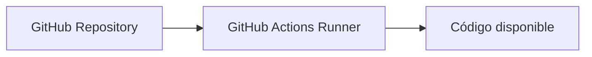
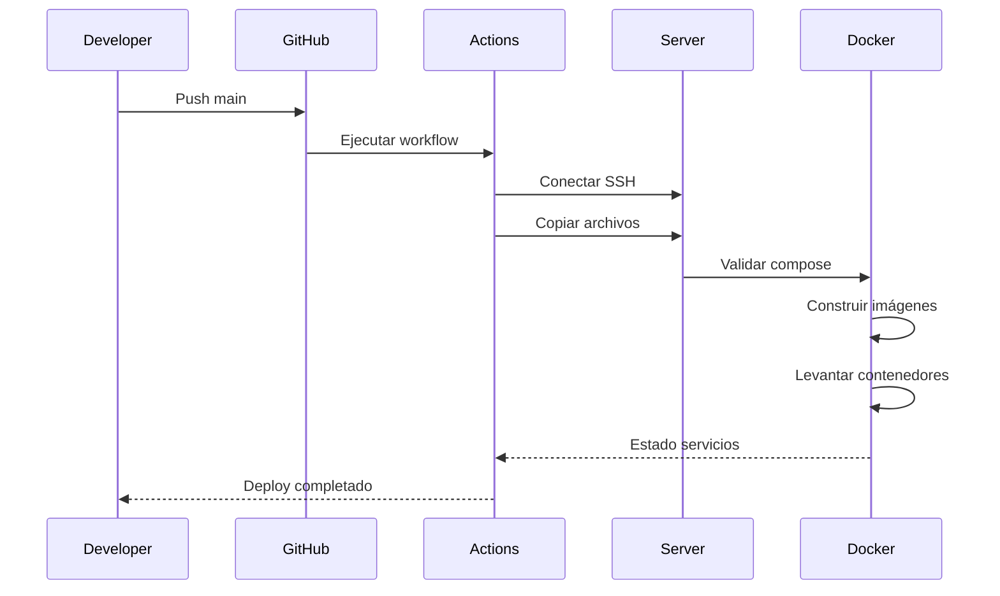

El despliegue del servicio ProDesign Geometry Service está automatizado mediante GitHub Actions.

El proceso permite actualizar la aplicación en el servidor de producción mediante:

- Sincronización automática de código.
- Construcción de imágenes Docker.
- Actualización de contenedores.
- Validación del estado del servicio.

---

# Arquitectura de Despliegue

```mermaid
flowchart LR

A[Developer]

A --> B[Git Repository]

B --> C[Push Branch main]

C --> D[GitHub Actions]

D --> E[Checkout Código]

E --> F[Sincronización SSH]

F --> G[Servidor Producción]

G --> H[Docker Compose]

H --> I[Build Images]

I --> J[Actualizar Contenedores]

J --> K[Servicio ProDesign Geometry API]
````

---

# Pipeline de Despliegue

## Trigger

El despliegue se ejecuta automáticamente cuando existe un push hacia:

```
main
```

Configuración:

```yaml
on:
  push:
    branches:
      - main
```

---

# Etapas del Despliegue

## 1. Checkout del Código

Responsabilidad:

Obtener la última versión del código fuente.

Proceso:



---

## 2. Sincronización de Archivos

Responsabilidad:

Copiar la aplicación hacia el servidor remoto.

Tecnología:

* SSH Deploy Action.

Destino:

```
Servidor Producción
```

Ruta:

```
/home/ftpceon/ftp/prodesign/prosesign_geometry_api/
```

---

## Archivos Excluidos

Durante la sincronización no se copian:

```
.git/

.github/

__pycache__/

.venv/

logs/

renders/

renders_ai/
```

Motivo:

Evitar copiar archivos temporales, configuraciones internas y archivos generados.

---

# 3. Validación Docker Compose

Antes de desplegar se valida la configuración:

```bash
docker compose config
```

Objetivo:

* Verificar sintaxis.
* Validar servicios.
* Detectar errores de configuración.

---

# 4. Construcción de Imágenes Docker

Proceso:

```bash
docker compose -p prodesign build
```

Responsabilidad:

* Construir nuevas imágenes.
* Aplicar cambios del código.
* Preparar nuevos contenedores.

---

# 5. Actualización de Contenedores

Proceso:

```bash
docker compose -p prodesign up -d
```

Responsabilidad:

* Crear contenedores.
* Actualizar servicios existentes.
* Ejecutar en segundo plano.

---

# 6. Validación del Estado

Proceso:

```bash
docker compose -p prodesign ps
```

Permite verificar:

* Servicios activos.
* Estado de contenedores.
* Errores de ejecución.

---

# Flujo Completo



---

# Requisitos del Servidor

El servidor debe contar con:

* Docker instalado.
* Docker Compose instalado.
* Acceso SSH habilitado.
* Permisos para ejecutar Docker.
* Directorio de despliegue configurado.

---

# Seguridad

El despliegue utiliza secretos de GitHub Actions:

Variables utilizadas:

```
SSH_PRIVATE_KEY
SERVER_IP
SSH_USER
```

Estas credenciales no están almacenadas en el repositorio.

---

# Estrategia de Actualización

Actualmente el despliegue utiliza:

```
Build
  |
  v
Replace containers
  |
  v
Run updated version
```

Permite actualizar el servicio sin realizar despliegue manual en servidor.
