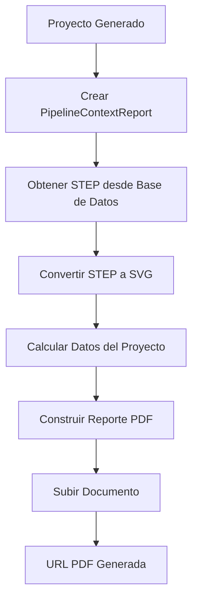

El servicio utiliza pipelines internos para ejecutar procesos de negocio complejos relacionados con:

- Generación automática de proyectos arquitectónicos.
- Generación de planos 2D/3D.
- Cálculo de costos de infraestructura.
- Generación de reportes PDF.

Cada pipeline está compuesto por etapas independientes (`stages`) que transforman y enriquecen la información del proyecto mediante un contexto compartido.

---

# 1. Pipeline de Generación de Proyecto Arquitectónico

## Descripción

Pipeline encargado de generar un proyecto arquitectónico basado en los parámetros recibidos.

Este proceso realiza:

- Clasificación regional.
- Obtención de ambientes requeridos.
- Construcción geométrica del plano.
- Conversión a formato CAD.
- Persistencia del proyecto generado.

---

## Flujo del Pipeline

```mermaid
flowchart TD

A[ProjectRequest] --> B[Crear PipelineContext]

B --> C[Stage: Clasificar Región]

C --> D[Stage: Obtener Ambientes]

D --> E[Stage: Construcción del Plano]

E --> F[Stage: Convertir Plano y Guardar]

F --> G[Stage: Actualizar Datos del Proyecto]

G --> H[Proyecto Arquitectónico Generado]
````

---

## Etapas

### Stage: Clasificación de Región

Responsabilidad:

Determina la región/configuración aplicable al proyecto.

Entrada:

* Información del proyecto.

Salida:

* Región clasificada.

---

### Stage: Obtener Ambientes

Responsabilidad:

Obtiene la distribución requerida de ambientes.

Ejemplos:

* Aulas.
* Laboratorios.
* Servicios higiénicos.
* Áreas administrativas.

Salida:

* Lista de ambientes a generar.

---

### Stage: Construcción del Plano

Responsabilidad:

Genera la geometría arquitectónica.

Procesos:

* Distribución espacial.
* Creación de componentes.
* Aplicación de reglas geométricas.

Componentes generados:

* Muros.
* Puertas.
* Ventanas.
* Columnas.
* Pisos.
* Techos.

---

### Stage: Conversión de Plano y Guardado

Responsabilidad:

Convierte la geometría generada a formatos de salida.

Procesos:

* Generación modelo 3D.
* Conversión CAD.
* Almacenamiento de versión del proyecto.

---

### Stage: Actualización de Proyecto

Responsabilidad:

Actualiza información final del proyecto en persistencia.

Guarda:

* Estado.
* Geometría.
* Referencias generadas.

---

# 2. Pipeline de Cálculo de Costos de Infraestructura

## Descripción

Pipeline encargado de calcular costos preliminares de infraestructura utilizando la información generada del proyecto arquitectónico.

El cálculo se basa en:

* Ambientes generados.
* Áreas.
* Distribución arquitectónica.
* Parámetros económicos.

---

## Flujo del Pipeline

```mermaid
flowchart TD

A[Proyecto Arquitectónico] --> B[Crear PipelineContextCostos]

B --> C[Obtener Región del Proyecto]

C --> D[Procesar información de costos]

D --> E[Extraer datos desde Google Sheets]

E --> F[Calcular Costos Infraestructura]

F --> G[Serializar Resultado JSON]

G --> H[Guardar cálculo asociado al proyecto]

H --> I[Resultado de Costos]
```

---

## Etapas

### Crear Contexto de Costos

Responsabilidad:

Inicializar información necesaria para el cálculo.

Contiene:

* Datos del proyecto.
* Parámetros económicos.

---

### Procesamiento de Costos

Responsabilidad:

Ejecutar la lógica de cálculo de infraestructura.

Incluye:

* Consulta de parámetros.
* Aplicación de valores económicos.
* Generación de resumen.

---

### Extracción desde Google Sheets

Responsabilidad:

Obtener información configurable para el cálculo.

Fuente:

* Google Sheets de costos de infraestructura.

---

### Persistencia

Responsabilidad:

Guardar el resultado calculado.

Salida:

* JSON de costos.
* Asociación al proyecto.

---

# 3. Pipeline de Generación de Reporte PDF

## Descripción

Pipeline encargado de generar el reporte final del proyecto arquitectónico.

Incluye información gráfica y métricas calculadas.

---

## Flujo del Pipeline



---

## Etapas

### Obtener STEP desde Base de Datos

Responsabilidad:

Recuperar el modelo 3D generado previamente.

Entrada:

* ID del proyecto.

Salida:

* Archivo STEP.

---

### Conversión STEP a SVG

Responsabilidad:

Transformar el modelo CAD en una representación visual.

Salida:

* SVG para incluir en reporte.

---

### Cálculo de Datos

Responsabilidad:

Obtener métricas del proyecto.

Incluye:

* Pisos.
* Áreas.
* Información geométrica.

---

### Construcción y Upload del Reporte

Responsabilidad:

Generar documento PDF final.

Salida:

* URL del reporte.

---

# Consideraciones Técnicas

* Cada pipeline utiliza un objeto Context para compartir información entre etapas.
* Las etapas están separadas por responsabilidad.
* Permite agregar nuevos procesos sin modificar pipelines existentes.
* Los resultados generados pueden ser utilizados por otros módulos de ProDesign.
